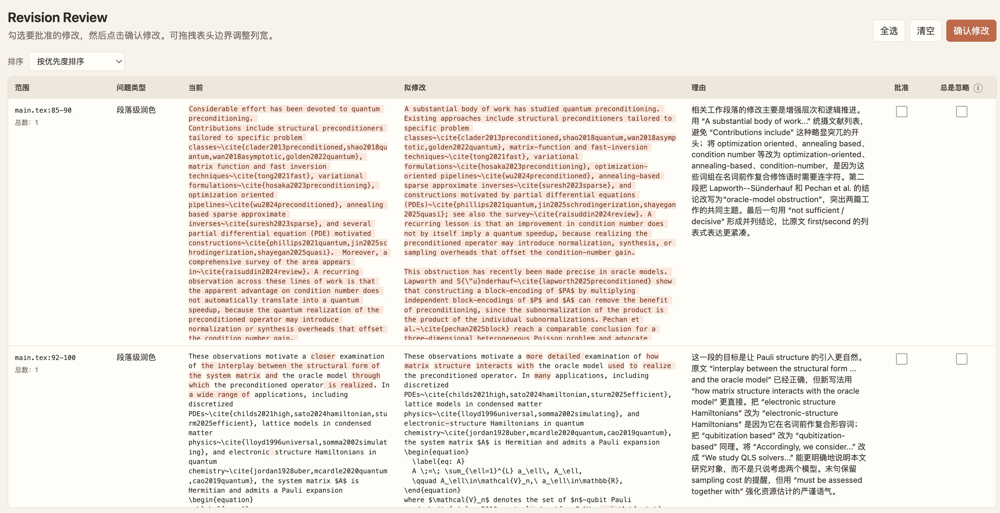

# Thesis Revision Skill

[中文](README.md) | [English](README.en.md)

`thesis-revision` is an agent skill for review-ready revision of LaTeX theses and dissertations. It focuses on non-logical issues: examiner comments, thesis-wide grammar and consistency, bibliography quality, abstract polishing, LaTeX cross-references, build logs, and PDF presentation.

## Features

- Review examiner comments and produce a traceable minimal revision plan.
- Use `revision-check` as the approval skill so nontrivial edits are applied only after user approval.
- Draft Chinese official materials for examiner-comment revision explanations and advisor opinions.
- Run thesis-wide grammar and academic prose checks while avoiding LaTeX, math, and citation noise.
- Generate a project-level style sheet for terminology, notation, headings, citations, and bilingual wording.
- Check structure, terminology, notation, heading style, citations, and prose consistency across chapters assembled from multiple papers.
- Inspect BibTeX entries for duplicates, capitalization protection, official publication versions, venue formatting, URLs, editions, and malformed fields.
- Support optional formal-publication verification for references when online checking is requested.
- Polish bilingual abstracts and check consistency between Chinese and English abstracts and keywords.
- Diagnose LaTeX/PDF issues such as undefined references, repeated auto-reference words, algorithm line-number references, TOC page numbers, and bibliography formatting.
- Default to a review-first workflow: report and plan before editing, unless the user explicitly asks for direct edits.

## Installation

You need a mainstream coding agent that supports custom skills, rules, or project instructions, such as [Codex](https://chatgpt.com/codex/), [Claude Code](https://code.claude.com/docs/en/quickstart), or [Cursor CLI](https://cursor.com/).
thesis-revise depends on revision-check. In most cases, ask your agent:

```text
Install the skill from https://github.com/nht2018/thesis-revise.git as thesis-revision.
Install the skill from https://github.com/nht2018/revision-check.git as revision-check.
```

The agent will usually fetch and enable these skills through its own mechanism.

## Usage

Example prompts:

```text
Use $thesis-revision to review this LaTeX thesis before submission.
Use $thesis-revision to handle these examiner comments and propose minimal edits.
Use $thesis-revision to draft the Chinese revision explanation and advisor opinion for these examiner comments.
Use $thesis-revision to run a full grammar and prose check on this thesis.
Use $thesis-revision to generate a project style sheet before consistency edits.
Use $thesis-revision to check bibliography duplicates and BibTeX capitalization.
Use $thesis-revision to polish the Chinese and English abstracts and check consistency.
```

The approval page will open automatically in the browser, where you can review and approve proposed changes.


## Design Principles

- Be general: do not assume a specific thesis template, folder structure, discipline, or terminology set.
- Be conservative: preserve technical claims, theorems, algorithms, experiments, and conclusions.
- Be traceable: connect every expert comment to a location, action, and verification step.
- Be minimal: prefer local sentence-level edits and style normalization over broad rewrites.
- Be verifiable: compile the thesis and inspect logs/PDF output after edits.
